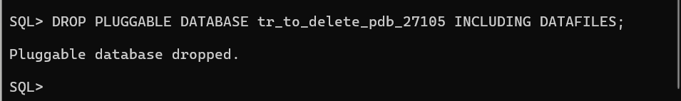

# Pl-assignment-2--Tracy-Uwase

# Oracle Pluggable Database (PDB) Assignment  
**Student Name:** Tracy  
**Student ID:** 27105  
**Course:**  PL/SQL 

---

##  Executive Summary  
This assignment demonstrates hands-on skills in Oracle Multitenant Database Administration, focusing on **PDB creation, lifecycle management, and Enterprise Manager configuration**.  

---

##  Tasks Completed  

### Task 1: Create Permanent PDB  
- Created **`tr_pdb_27105`** with user **`tracy_plsqlauca_27105`** (`password`).  
- Granted roles: CONNECT, RESOURCE, DBA, UNLIMITED TABLESPACE.  
- Verified creation with `v$pdbs` and `dba_users`.  
- Configured **auto-open** on startup.  

 Result: Permanent PDB ready for coursework.  

**Screenshots:**  
-   
-   
-   

---

### Task 2: Create & Delete Temporary PDB  
- Created **`tr_to_delete_pdb_27105`** with admin user.  
- Opened and verified with `v$pdbs`.  
- Closed and dropped with `INCLUDING DATAFILES`.  
- Confirmed only **`tr_pdb_27105`** remains.  

 Result: Demonstrated full PDB lifecycle management.  

**Screenshots:**  
-   
-   
-   
-   
-   

---

### Task 3: Configure Enterprise Manager Express (EM Express)  
- Set HTTPS port **5500**.  
- Logged in as SYSDBA, accessed **Dashboard**.  
- Verified:  
  - **Configuration → Pluggable Databases** → `tr_pdb_27105` OPEN.  
  - **Security → Users** → `tracy_plsqlauca_27105` visible.  
  - **PDB Details Page** accessible.  

 Result: OEM Express functional and monitoring enabled.  

**Screenshots:**  
-   
-   

---

##  Issues & Solutions  
- **Port Conflict:** Already configured → verified with query, reused port 5500.  
- **Wrong Container Context:** Initially in CDB instead of PDB → fixed using `ALTER SESSION SET CONTAINER`.  

---

##  Conclusion  
- **PDB Management mastered:** Creation, configuration, deletion.  
- **User Administration learned:** User setup, privileges, container context.  
- **OEM Express explored:** Dashboard, PDBs, users.  

The **permanent PDB `tr_pdb_27105`** is fully operational for PL/SQL coursework and future database administration exercises.  
